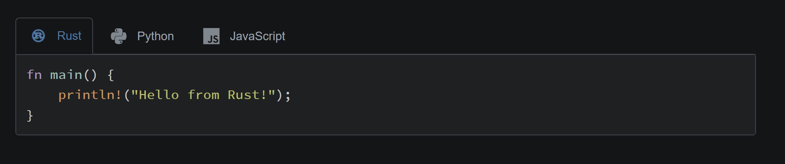

# mdbook-langtabs

[](https://crates.io/crates/mdbook-langtabs)
[](https://opensource.org/licenses/MIT)

An [mdBook](https://github.com/rust-lang/mdBook) preprocessor that creates language tabs for code examples.



## Features

- Switch between language examples without scrolling
- Automatic language icons via [Devicon](https://devicon.dev/)
- Remembers selected language preference

## Installation

```bash
cargo install mdbook-langtabs
```

Or install the current development version:

```bash
cargo install --git https://github.com/nx10/mdbook-langtabs
```

## Setup

Either use the automatic installer:

```bash
mdbook-langtabs install /path/to/your/book
```

Or manually:

1. Add to your `book.toml`:

```toml
[preprocessor.langtabs]
command = "mdbook-langtabs"

[output.html]
additional-css = ["langtabs.css"]
additional-js = ["langtabs.js"]
```

2. Copy `langtabs.css` and `langtabs.js` to your book's root directory.

## Usage

Wrap your code blocks with the special comments:

````markdown
<!-- langtabs-start -->
```rust
fn main() {
    println!("Hello from Rust!");
}
```

```python
def main():
    print("Hello from Python!")
```

```javascript
function main() {
    console.log("Hello from JavaScript!");
}
```
<!-- langtabs-end -->
````

This creates tabbed code examples that readers can switch between, as shown in the demo above.

## License

MIT